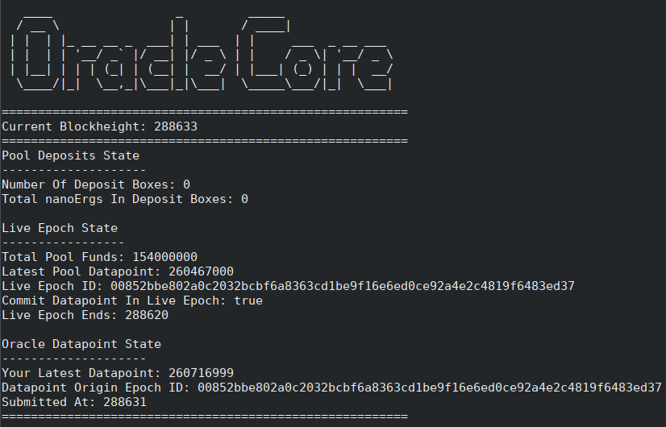

# Oracle Core



The oracle core is the off-chain component that oracles who are part of an oracle pool run. This oracle core provides a HTTP API interface for reading the current protocol state & another for submitting datapoints. Once a datapoint is submit the oracle core will automatically generate the required tx and post it as well as any other actions required for the protocol to run. This thereby allows the oracle to participate in the oracle pool protocol without any extra effort for the oracle operator.

The oracle core requires that the user has access to a full node wallet in order to create txs & perform UTXO-set scanning. Furthermore each oracle core is designed to work with only a single oracle pool. If an operator runs several oracles in several oracle pools then a single full node can be used, but several instances of oracle cores must be run (and set with different api ports).

A `Connector` must also be used with the oracle core in order to acquire data to submit to the pool. Each connector sources data from the expected sources, potentially applies functions to said data, and then submits the data to the oracle core via HTTP API during the `Live Epoch` stage in the oracle pool protocol. All oracles for a given pool are expected to use the exact same connector, thereby making it simple to onboard and get started.

The current oracle core is built to run the protocol specified in the [Basic Oracle Pool Spec](https://github.com/ergoplatform/oracle-core/blob/master/docs/specs/Basic-Oracle-Pool-Spec.md). Future versions will also support stake slashing and governance, with the specs already available for reading in the [specs folder](docs/specs).

Other documents can also be found explaining how various parts of the oracle core work in the [docs folder](docs).


# Building & Running An Oracle
The majority of oracle operators will only need to focus on setting up their own oracle core to work with an [already bootstrapped oracle pool](#Bootstrapping-An-Oracle-Pool). This section will explain how to do so for oracles using the ERG-USD connector. The steps are exactly the same for other connectors, but simply require using that connector's prepare script.

It is assumed that you are running this oracle on Linux, and have the following prerequisites:
- Access to an [Ergo Node](https://github.com/ergoplatform/ergo) v3.3.0+ with an unlocked wallet.
- A recent stable version of the [Rust Compiler](https://www.rust-lang.org/tools/install) installed.
- The Linux CLI tool `screen` and the `libssl-dev` package on Ubuntu (aka `openssl-devel` on Fedora, and potentially slightly different on other distros) installed.

1. Clone this repository via:
```sh
git clone git@github.com:ergoplatform/oracle-core.git
```
2. Enter into the connector's script folder:
```sh
cd oracle-core/scripts/erg-usd-oracle
```
3. Run the prepare script which will automatically compile the oracle core and the connector for you:
```sh
sh prepare-erg-usd-oracle.sh
```
4. Enter into the newly created `oracle-core-deployed` folder:
```sh
cd ../../erg-usd-oracle-deployed & ls
```
5. Edit your `oracle-config.yaml` with your Ergo Node information, your oracle address (address that was used for bootstrapping the pool & is inside of your Ergo Node wallet), and other relevant pool information. (Optionally acquire a pre-configured `oracle-config.yaml` from the user who bootstrapped the oracle pool and simply fill in your node info/oracle address)
6. Ensure your Ergo Node is running (and matches the info you input in the config) and has it's wallet unlocked (with some Ergs in the wallet to pay for tx fees).
7. Launch your oracle by running `run-oracle.sh`:
```sh
sh run-oracle.sh
```
8. A `screen` instance will be created which launches both the oracle core and the connector. (Press `Ctrl+a - n` to go between the core & the connector screens).
9. If your node is running and properly configured, the oracle core will inform you that it has successfully registered the required UTXO-set scans:
```sh
UTXO-Set Scans Have Been Successfully Registered With The Ergo Node
```
10. Press enter to confirm that the scans have been registered. Your oracle core is now properly set up and waiting for the UTXO-set scans to be triggered in order to read the state of the oracle pool on-chain to then perform actions/txs.
11. Rescan the blockchain history by either using the `/wallet/rescan` GET endpoint of your node, or by deleting `.ergo/wallet/registry` in your Ergo Node folder. Either option triggers a rescan after the blockchain progresses into the next block.
12. Once the node has finished rescanning (which can be checked via the `/wallet/status` endpoint and comparing the `walletHeight` value to the current blockheight), the oracle core & connector will automatically issue transactions and move the protocol forward.
13. Congrats, you can now detach from the screen instance if you wish via `Ctrl+a d`. (And reattach via `screen -r`) Your oracle core/connector will run automatically going forward.


# Bootstrapping An Oracle Pool
In order for an oracle pool to run, it must be first created/bootstrapped on-chain. This is the bootstrap process that is required before oracle operators can run their oracle core and have the pool function on-chain.

Check out the [Oracle Pool Bootstrap folder](oracle-pool-bootstrap) for detailed instructions about how to bootstrap an oracle pool using the CLI tool or manually.


# Writing A New Connector
If you are looking to create a new Oracle Pool for a new datapoint, you need to write a new Connector. This process has been greatly simplified thanks to [`Connector Lib`](connectors/connector-lib).

Now within 15-20 lines of Rust code, you can easily create your own Connector that plugs right in to the Oracle Core.

If you would like to integrate your pool with the Ergo Explorer we have also created [`Frontend Connector Lib`](connectors/frontend-connector-lib). This library builds off of `Connector Lib` and automatically provides + runs an API server which produces all of the data required for the frontend.

Building a Frontend Connector provides a single endpoint which summarizes the majority of relevant data about your Oracle Pool, and as such can also be useful if you intend to create your own custom website/frontend for showing off what is going on in your pool.