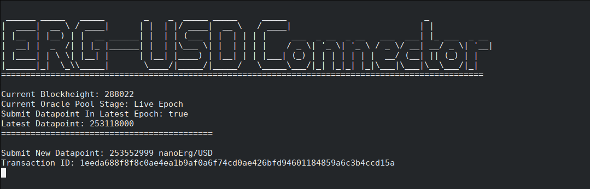

# ERG-USD Connector

This is a connector which fetches the values of nanoErg/USD and submits it to the oracle core.

Do note, the value submitted on-chain is the number of nanoErgs per US Dollar. This is to prevent using division/floats, and as such is not the price of 1 Erg in USD, but the number of nanoErgs per 1 USD.

This makes little difference in practice, but the developer must understand before using said data.

# How To Use The Connector

1. Compile the connector via `cargo build --release`.
2. Copy the compiled binary from `target/release/` into the same folder as your `oracle-config.yaml`.
3. Run the connector via `./erg-usd-connector`.
