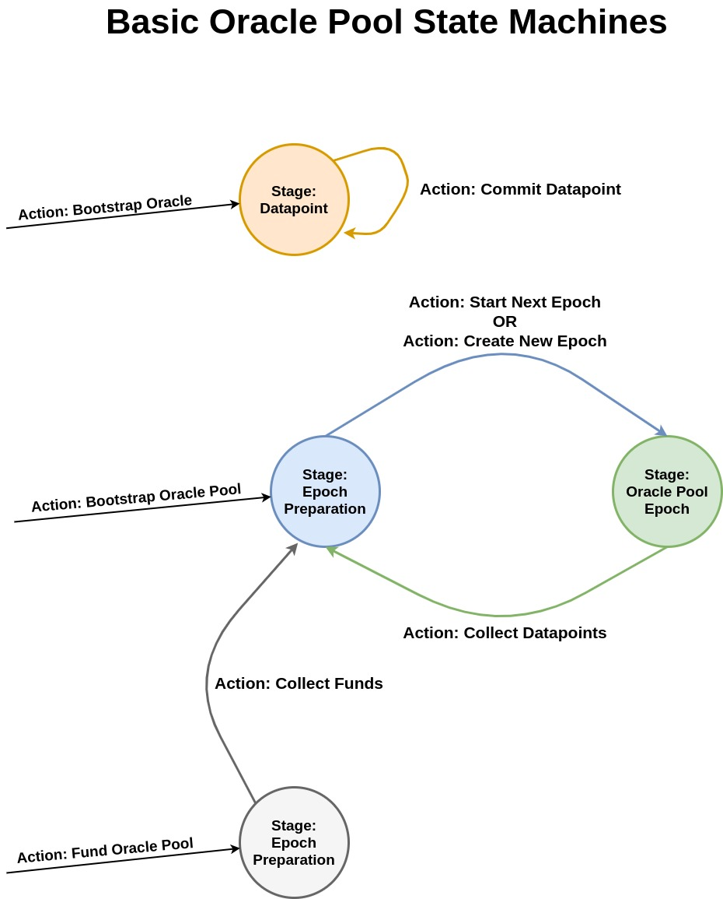

# Basic Oracle Pool Spec
This is an informal specification which defines an oracle pool implementation which allows entry by predefined/whitelisted trusted oracles.

Oracle pools split up time into *epochs* which are the number of blocks in between datapoint postings by the pool. For example an oracle pool may have a posting schedule of every 30 blocks, thus every epoch is 30 blocks long. Oracles must post their individual datapoint into their own designated UTXO on-chain every single epoch. At the end of an epoch, all oracles race to find all of the other oracle's datapoint boxes, and post a collection transaction.

The collection transaction folds all of the individual datapoints, thereby averaging them out and coming up with a *finalized datapoint* which is then saved in register R4 of the oracle pool's box. This transaction marks the end of the previous epoch and pays out all oracles who submitted good data. Thus at the end of each epoch, anyone on the Blockchain has access to a new finalized datapoint from the oracle pool that can be used as a data-input.

In this design all of the oracles are incentivized to be the first to submit the collection transaction to end an epoch. The first to get their collection accepted into a block (hereby dubbed the **collector**), gets double the reward for the current epoch payout. Thus we have incentives for both oracles submitting their individual datapoints on time as well as finalizing the oracle pool's datapoint every epoch.

There is a *margin of error* which all oracles must be within in order to get rewarded for being accurate in the given epoch. If they are not accurate, the current scheme does not pay them out (rather than slashing which is a bit aggressive).

Submitting funds to the pool and oracles submitting datapoints are parallelized which allows for the pool to move through epochs smoothly.

The diagram below shows off the state machines which comprise a basic oracle pool. This explains at a high level how a simple oracle pool works.



Do note, this only displays the state transitions (actions), which map onto spending paths. This diagram does not include data-inputs to keep it readable and understandable.


## Stage ToC
1. [Oracle Pool Epoch](<#Stage-Oracle-Pool-Epoch>)
2. [Epoch Preparation](<#Epoch-Preparation-Stage>)
3. [Datapoint](<#Stage-Datapoint>)
4. [Pool Deposit](<#Stage-Pool-Deposit>)


## Action ToC
1. [Bootstrap Oracle Pool](<#Action-Bootstrap-Oracle-Pool>)
2. [Bootstrap Oracle](<#Action-Bootrap-Oracle>)
3. [Commit Datapoint](<#Action-Commit-Datapoint>)
4. [Collect Datapoints](<#Action-Collect-Datapoints>)
5. [Fund Oracle Pool](<#Action-Fund-Oracle-Pool>)
6. [Collect Funds](<#Action-Collect-Funds>)
7. [Start Next Epoch](<#Action-Start-Next-Epoch>)
8. [Create New Epoch](<#Action-Create-New-Epoch>)
---


## Stage: Oracle Pool Epoch
This stage signifies that the oracle pool is currently in an active epoch. While the oracle pool box is in this stage oracles are allowed to post new datapoints which will then be collected at the end of the epoch.

This oracle pool box also has an NFT/singleton token which can be used to identify it and differentiate it from another instance of the contract posted by an unknown bad actor.

### Registers
- R4: The latest finalized datapoint (from the previous epoch)
- R5: Block height that the current epoch will finish on

### Hard-coded Values
- Addresses of all trusted oracles (this is used for an extra safety measure to prevent others who aren't oracles from collecting)
- Oracle pool epoch length/posting schedule (integer number of blocks in between epochs)
- Margin of error(%) that oracles are allowed to be off by.
- The price for each oracle pool datapoint posting
- The oracle pool NFT/singleton token id


### Actions/Spending Paths
- [Collect Datapoints](<#Action-Collect-Datapoints>)
---


## Stage: Epoch Preparation
This is the alternative stage that the oracle pool box can be in after a previous epoch has finished. The pool is awaiting for the next epoch to begin.

Progression into the proceeding epoch (and thus into the [Oracle Pool Epoch](<#Stage-Oracle-Pool-Epoch>) stage once again) is allowed if:
- The box has sufficient funds to payout oracles
- At least 4 blocks have passed since the [Epoch Preparation](<#Epoch-Preparation-Stage>) has started

During this epoch preparation period collecting [Pool Deposit](<#Stage-Pool-Deposit>) boxes can be done. 

If the oracle pool has insufficient funds and thus skips posting for a given epoch, then a new epoch must be created afterwards via [Create New Epoch](<#Action-Create-New-Epoch>) once the pool box has been funded.

### Registers
- R4: The latest finalized datapoint (from the previous epoch)
- R5: Block height the upcoming epoch will finish on (Typically previous epoch finish height + epoch length)

### Hard-coded Values
- Addresses of all trusted oracles (this is used for an extra safety measure to prevent others who aren't oracles from collecting)
- Oracle pool epoch length/posting schedule (integer number of blocks in between epochs)
- The price for each oracle pool datapoint posting
- The oracle pool NFT/singleton token id


### Actions/Spending Paths
- [Collect Funds](<#Action-Collect-Funds>)
- [Start Next Epoch](<#Action-Start-New-Epoch>)
- [Create New Epoch](<#Action-Create-New-Epoch>)
--- 


## Stage: Datapoint
A box at this stage means that the oracle at hand has posted data on-chain in the given epoch and is waiting for the epoch to end and for it to be collected.


### Registers
- R4: The address of the oracle (never allowed to change after bootstrap).
- R5: The box id of the latest [Oracle Pool Epoch](<#Stage-Oracle-Pool-Epoch>) box.
- R6: The oracle's datapoint.

### Actions/Spending Paths
- [Commit Datapoint](<#Action-Commit-Datapoint>)
--- 


## Stage: Pool Deposit
Anyone on the Ergo Blockchain can fund the given oracle pool by creating a box with Ergs in it at this stage/contract address. This contract checks to make sure that it can only be collected into the Oracle Pool box based off of the hard-coded ID of the singleton token and the address of the Oracle Pool contract.

### Hard-coded Values
- ID of the NFT/singleton token of the oracle pool
- Address of the Oracle Pool contract

### Actions/Spending Paths
- [Collect Funds](<#Action-Collect-Funds>)
--- 


## Action: Bootstrap Oracle Pool
---
In order to create a new oracle pool, a NFT/singleton token must be created prior and will be used in bootstrapping. This singleton token will be locked initially inside the bootstrapped [Epoch Preparation](<#Epoch-Preparation-Stage>) box. As the pool progresses forward in and out of the [Oracle Pool Epoch](<#Stage-Oracle-Pool-Epoch>) stage, the NFT/singleton token must always be within the box and cannot be spent elsewhere. This token thereby marks the given oracle pool's current box (in whichever of the two stages it is currently in) and makes it unique/unforgable.

Before creation, the oracle pool must decide on the:
- Epoch length (Hardcoded into contract)
- The addresses of the oracles (Hardcoded)
- Post price (Hardcoded)
- The block height that the first epoch ends (Stored in R5 of bootstrapped [Epoch Preparation](<#Epoch-Preparation-Stage>))

The epoch can only be started on block heights after `[Finish Block Height Of Upcoming Epoch (R5)] - [Epoch Length] + 4` and so it will bootstrap cleanly.

### Inputs
1. A box with an NFT/singleton token which will be used to identify the pool. 
2. One or more boxes with Ergs to be used for initial oracle pool payments.

### Outputs
#### Output #1
An [Epoch Preparation](<#Epoch-Preparation-Stage>) box with:
- The Input NFT
- The Input Ergs
- R4: A default/placeholder datapoint value (has no effect in bootstrap)
- R5: The block height that the first epoch ends
---


## Action: Bootstrap Oracle
Each oracle who is to be part of the oracle pool must be bootstrapped in. This current protocol uses a trusted bootstrap funnel to do so (meaning a single trusted actor bootstraps all participants into the protocol).

Prior to bootstrapping oracles, a new "oracle pool participant" token must be created which has a total quantity equal to the number of oracles who will be part of the oracle pool. Each oracle's box that will be bootstrapped will hold one of said participant token in order to make it unique and also easy to find.

Thus the bootstrapper creates boxes which are each owned by a predefined single oracle who will use their given box to commit datapoints to the oracle pool. This box will always hold the oracle pool token, hold the given oracle's address in R4, and always be in the [Datapoint](<#Stage-Datapoint>) stage.

Once bootstrapped, the oracle must wait until the block height gets close enough to begin the first epoch via [Start Next Epoch](<#Action-Start-Next-Epoch>). 

### Inputs
1. A box with a single oracle pool participant token.

### Outputs
#### Output #1
A box in [Datapoint](<#Stage-Datapoint>) stage which:
- Holds a single oracle pool token.
- R4: The address of the oracle who will be a participant in the pool
- R5: Placeholder box id value
---


## Action: Commit Datapoint
During an active epoch when the oracle pool box is in the [Oracle Pool Epoch](<#Stage-Oracle-Pool-Epoch>) stage, any oracle can commit a new datapoint for said epoch.

Lastly, when a new datapoint is commit, the [Oracle Pool Epoch](<#Stage-Oracle-Pool-Epoch>) must be used as a data-input in order to acquire it's box id. This box id is then put in R5 of the new [Datapoint](<#Stage-Datapoint>) output, thereby ensuring that the datapoint was posted in the current epoch.


### Data-Inputs
1. [Oracle Pool Epoch](<#Stage-Oracle-Pool-Epoch>)

### Inputs
1. The oracle's [Datapoint](<#Stage-Datapoint>) box.

### Outputs
1. [Datapoint](<#Stage-Datapoint>).

### Action Conditions
1. The output's R5 is equal to the data-input's box id.
2. R4 of the [Datapoint](<#Stage-Datapoint>) input box is equal to R4 of output box.
3. R6 of the output box is not empty/holds a value of the correct type (ex. Int)
4. Only the owner (address in [Datapoint](<#Stage-Datapoint>) R4) can spend the box.
5. Output still holds the oracle pool token.
---


## Action: Collect Datapoints
Allows an oracle to use all of the individual oracle [Datapoint](<#Stage-Datapoint>) boxes (from the current epoch) as data-inputs and fold the datapoints together into the finalized oracle pool datapoint and thereby finishing the current epoch.

This action can only be initiated if the current height is greater than the block height in R5 of the existing [Oracle Pool Epoch](<#Stage-Oracle-Pool-Epoch>) box (which represents the end height of the epoch). Due to all oracles being incentivized to collect via double payout, it is expected that at least one oracle will post the collection tx at the exact height of the new epoch, thereby generating the new [Epoch Preparation](<#Epoch-Preparation-Stage>) box.

An oracle is rewarded for the epoch if they posted a datapoint that is within the margin of error (which is a % hardcoded in the [Oracle Pool Epoch](<#Stage-Oracle-Pool-Epoch>) contract) of the finalized datapoint.

Only datapoints commit during the latest epoch (checked by comparing R5 of data-inputs with the input [Oracle Pool Epoch](<#Stage-Oracle-Pool-Epoch>) box) are allowed to be collected.

###### Finalize Datapoint Function
This is the function which produces the finalized datapoint by folding down the input oracle datapoints produced during the epoch. The simplest function we can use is an average.
```haskell
[Summed Total Of Oracle Input Datapoints] / [Number Of Oracle Input Datapoints]
```
Using a more complex equation is likely a good idea and/or filtering major outliers before averaging. (To be done in future draft)

###### Successful Oracle Epoch Payout Function
This is the amount of Ergs which a successful oracle (one that has provided a datapoint within the margin of error) is awarded at the end of an epoch. The plus one is to pay out the collector an extra portion for performing the collection.
```haskell
[Oracle Pool Posting Price] / ([Num Successful Oracles] + 1)
```

### Data-Inputs
1. Every oracle's [Datapoint](<#Stage-Datapoint>) box.

### Inputs
1. The [Oracle Pool Epoch](<#Stage-Oracle-Pool-Epoch>) box.

### Outputs
#### Output #1
The [Epoch Preparation](<#Epoch-Preparation-Stage>) box with the new datapoint

#### Output #2+
Payment boxes which are holding Ergs that are sent to each oracle who successfully provided a datapoint within the margin of error, plus an extra payment box to the collector (meaning the collector can get 1 or 2 payment boxes depending if they provide accurate data).

The equation for the amount of Ergs inside each payment box can be found in *Successful Oracle Epoch Payout Function* in the preamble.

### Action Conditions
1. Collecting datapoints can only be performed by one of the hard-coded oracles.
2. Output #1 has the oracle pool NFT.
3. Output #1 has Ergs equivilant to: `[Input #1 Ergs] - [Hardcoded Pool Payout]`
4. Output #1 R4 is the result of the `Finalize Datapoint Function`
5. Output #1 R5 is equal to: `[Input #1 R5] + [Hardcoded Epoch Length]`
6. A payment box output is generated for all of the successful oracles who provided a datapoint within the hardcoded margin of error (compared to finalized datapoint in R4 of Output #1). The addresses are acquired from the data-input [Datapoint](<#Stage-Datapoint>) box's R4.
7. Each payment box has a total amount of Ergs inside equal to the result of the `Successful Oracle Epoch Payout Function`.
8. Each data-input [Datapoint](<#Stage-Datapoint>) box has an R5 that is equal to Input #1 box id.
---


## Action: Fund Oracle Pool
A user can fund a given oracle pool by locking Ergs in the [Pool Deposit](<#Stage-Pool-Deposit>) stage. This is technically also a bootstrap action, however the user's participation in the multi-stage protocol ends immediately as there are no more actions which they can perform.

### Inputs
1. One or more boxes with Ergs.

### Outputs
1. A box in the [Pool Deposit](<#Stage-Pool-Deposit>) stage with Ergs inside.
---


## Action: Collect Funds
One of the oracles can collect any/all boxes on the blockchain that are in the [Pool Deposit](<#Stage-Pool-Deposit>) stage. Their Ergs are deposited into the [Epoch Preparation](<#Epoch-Preparation-Stage>) box thereby funding the oracle pool.

If a pool is ever underfunded, then this action must be performed to increase the funds above the threshold of one oracle pool payment before the next/a new epoch can begin.

### Inputs
1. The [Epoch Preparation](<#Epoch-Preparation-Stage>) box.
2. One or more [Pool Deposit](<#Stage-Pool-Deposit>) boxes.

### Outputs
1. The [Epoch Preparation](<#Epoch-Preparation-Stage>) box with everything the same but with an increased number of Ergs held.

### Action Conditions
1. Input #1 holds the oracle pool NFT (the NFT id is hardcoded in the [Pool Deposit](<#Stage-Pool-Deposit>) contract)
2. Output #1 holds the oracle pool NFT.
3. Output #1 has exactly the same registers as Input #1.
4. Output #1 holds equivilant to it's previous total plus the summed value of all input [Pool Deposit](<#Stage-Pool-Deposit>) boxes.
---


## Action: Start Next Epoch
After the previous epoch has ended via [Collect Datapoints](<#Action-Collect-Datapoints>) the oracle pool box *must* stay in the [Epoch Preparation](<#Epoch-Preparation-Stage>) stage until the block height has passed the following:

```haskell
[Finish Block Height Of Upcoming Epoch (R5)] - [Epoch Length] + 4
```

This provides a 4 block period (assuming the datapoint collection was performed on the first possible block height) where [Start Next Epoch](<#Action-Start-Next-Epoch>) cannot be used, and thus the new epoch cannot officially start (and so datapoints cant be updated). This is a buffer period where oracles can collect funds before the next epoch begins.

Furthermore, starting the next epoch requires the [Epoch Preparation](<#Epoch-Preparation-Stage>) box to have sufficient Ergs in order to payout the oracles at the end of the epoch. Thus even if the block height passes the epoch preparation buffer period, if the box has no funds then the epoch cannot begin. Once sufficient funds are collected via [Collect Funds](<#Action-Collect-Funds>) action, then the next epoch can begin.

This [Start Next Epoch](<#Action-Start-Next-Epoch>) action can only be called up until the block height has reached:
```haskell
[Finish Block Height Of Upcoming Epoch (R5)] - 4
```

This provides at least a few blocks for the new epoch to begin and datapoints to be submitted by oracles if acquiring/collecting funds took a long time.

If an epoch has passed without collecting funds in time, the oracle pool must instead use [Create New Epoch](<#Action-Create-New-Epoch>) to continue the protocol.

### Inputs
1. The [Epoch Preparation](<#Epoch-Preparation-Stage>) box.


### Outputs
1. The [Oracle Pool Epoch](<#Stage-Oracle-Pool-Epoch>) box in a new epoch.


### Action Conditions
1. The current block height is greater than  `[Input R5] - [Epoch Length] + 4`.
2. The current block height is less than  `[Input R5] - 4`.
3. The input box has more Ergs than the cost for one oracle pool posting payout.
4. R4 of both the input and output are equivalent.
5. R5 of both the input and output are equivalent.
6. The oracle pool NFT and all held Ergs from the input are in the output.
---


## Action: Create New Epoch

If the oracle pool is in the [Epoch Preparation](<#Epoch-Preparation-Stage>) stage and is underfunded, it can miss starting the next epoch (as [Start Next Epoch](<#Action-Start-Next-Epoch>) requires sufficient funds). 

Therefore, this action allows creating a brand new epoch after funds have been collected and an epoch has been missed. This is done by checking R5 and seeing if the block height has passed. If so, it means that none of the oracles started said epoch (which they have a game theoretic incentive to do so because they get paid) due to the pool not having sufficient funds to payout the oracles for the next epoch.

When a new epoch is created, the resulting R5 (the epoch finish height) of the new [Oracle Pool Epoch](<#Stage-Oracle-Pool-Epoch>) box, must be between:

```haskell
Minimum:
[Current Block Height] + [Epoch Length]

Maximum:
[Current Block Height] + [Epoch Length] + 4
```

This is to allow a bit of leeway for both submitting the tx (which could theoretically be in the mempool for a bit) as well as for oracles to have an extra buffer to notice that a new epoch has been created and thus the protocol restarted.

This is the biggest difference compared to [Start Next Epoch](<#Action-Start-Next-Epoch>), where [Create New Epoch](<#Action-Create-New-Epoch>) bases the epoch's finish block height off of when the action is submitted on-chain, while [Start Next Epoch](<#Action-Start-Next-Epoch>) continues the previous posting schedule by simply incrementing the previous epoch's finish height by the epoch length.


### Inputs
1. The [Epoch Preparation](<#Epoch-Preparation-Stage>) box.


### Outputs
1. The [Oracle Pool Epoch](<#Stage-Oracle-Pool-Epoch>) box in a new epoch.


### Action Conditions
1. The current block height is greater than R5 of the input.
2. The input box has more Ergs than the cost for one oracle pool posting payout.
3. The oracle pool NFT and all held Ergs from the input are in the output.
4. R4 of both the input and output are equivalent.
5. R5 of the output must be between `[Current Block Height] + [Epoch Length]` and `[Current Block Height] + [Epoch Length] + 4`.
---
